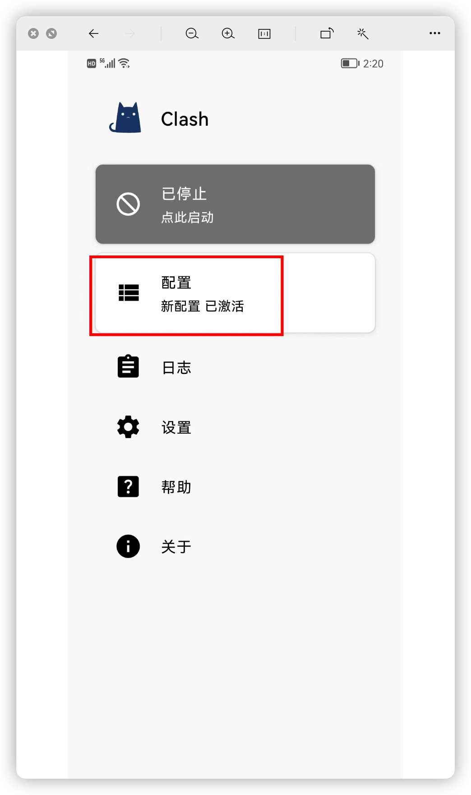
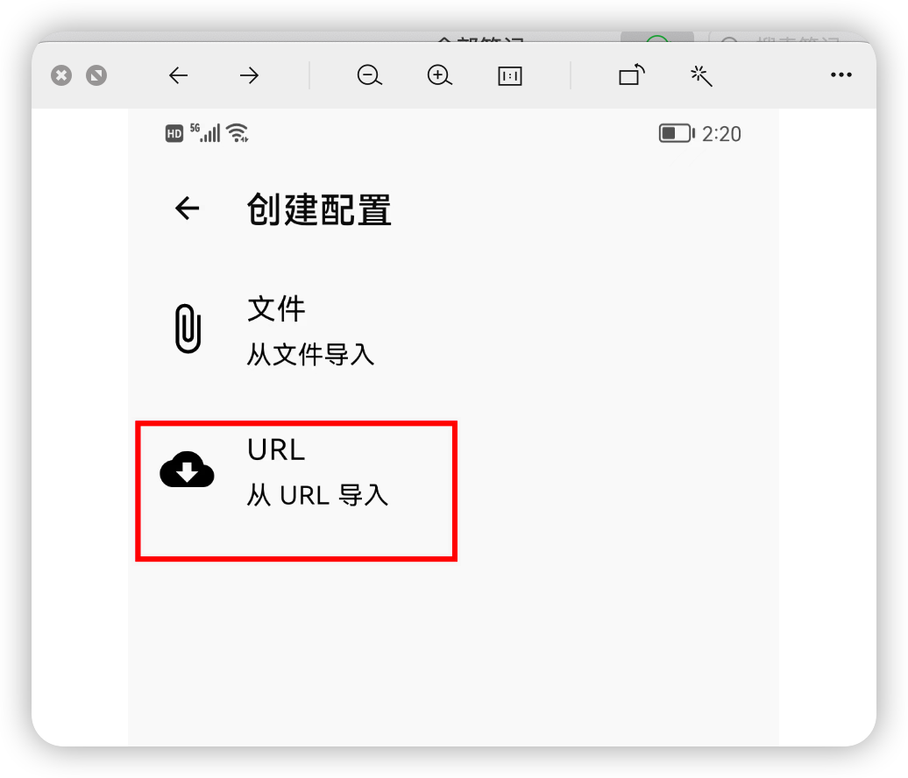
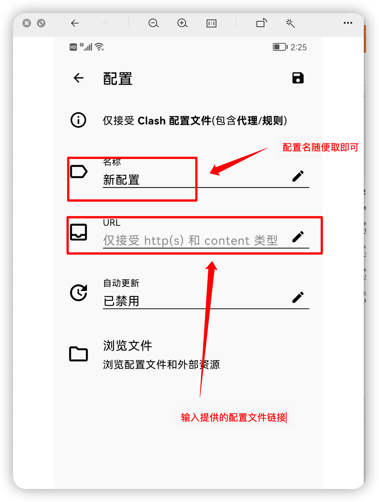
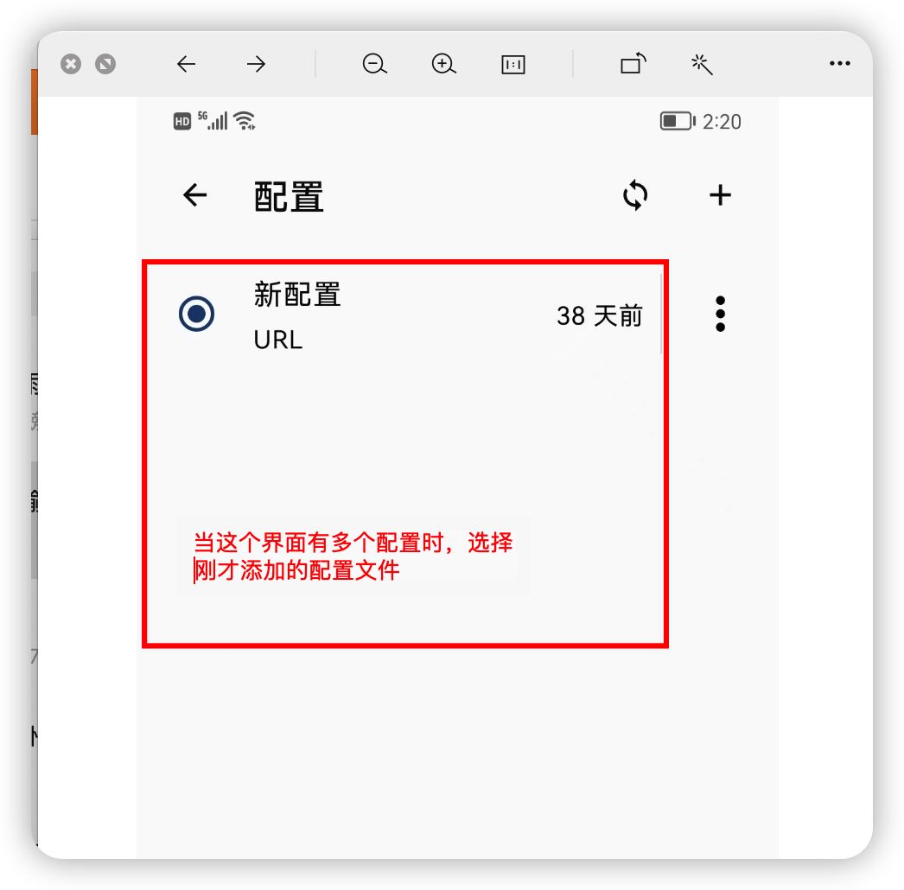
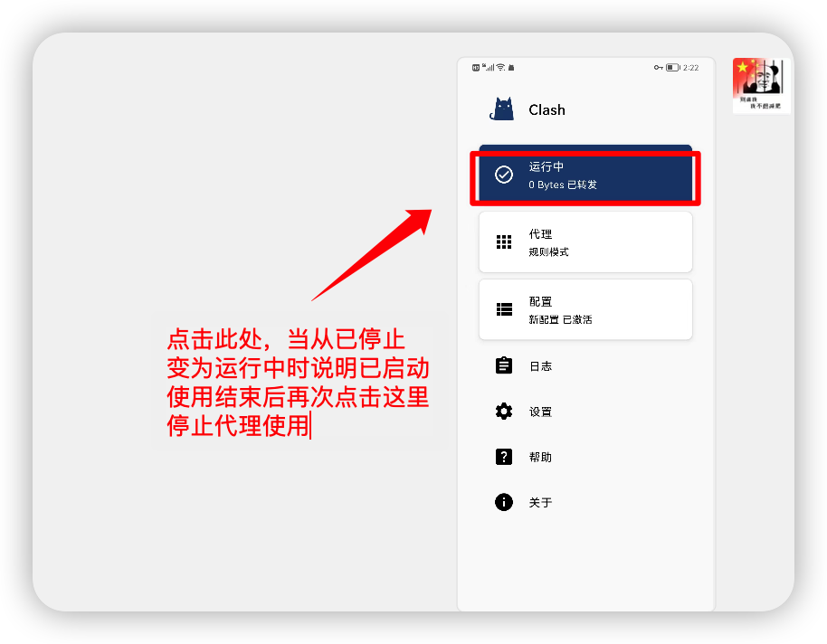

## 安卓配置vpn 教程

1.安装chash

2.打开chash主界面选择配置，然后选择右上角➕，选择url导入，输入配置文件链接https://sub.shuttle.mobi/app/clash/11834/Y8XPO8OjdYfJ，确定，然后回到主界面选择启动即可，使用结束点击启动按钮停止使用，具体如下图

3.配置完成后返回配置界面，当存在多个配置文件的时候选择刚才添加的配置文件，如下图

4.然后返回主界面选择启用即可,如下图

