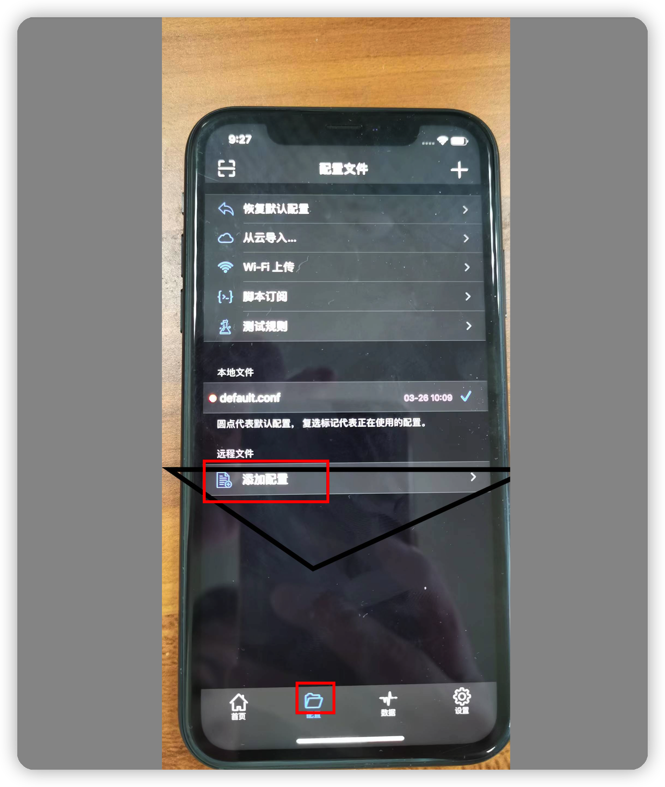
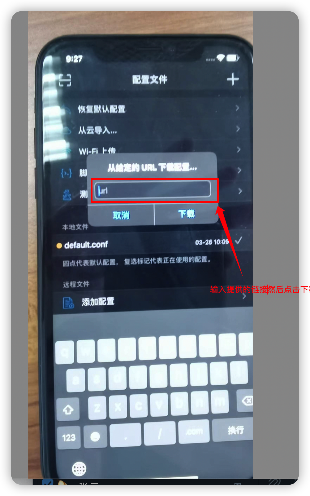
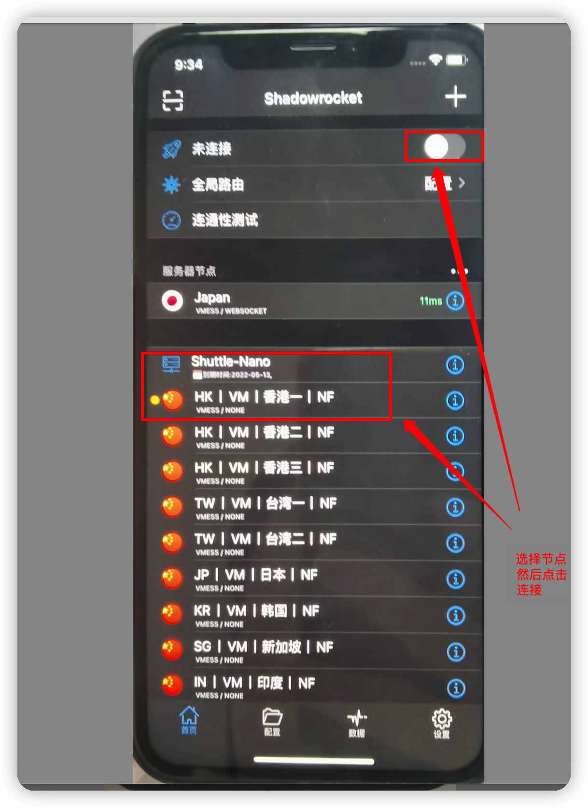

# ios配置vpn教程

1.打开appstore 退出自己的账号，登陆美国苹果账号（账号联系运维或人事人员提供）

2.点击搜索，输入shadowrocket   下载app;

3.点开shadowrocket   app，选择配置，然后选择添加配置，输入配置链接（链接由运维或人事提供）
点击下载,操作如下图(在下载配置时需提前检查当前vpn状态是否为未连接状态，如果是已连接需断开再继续操作)

4.选择首页，打开连接即可，如下图

 
配置时，注意不要同时操作，导致被检测到频繁账号登陆登出，容易导致账号被封
