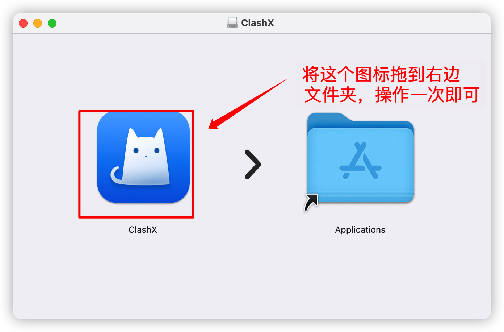
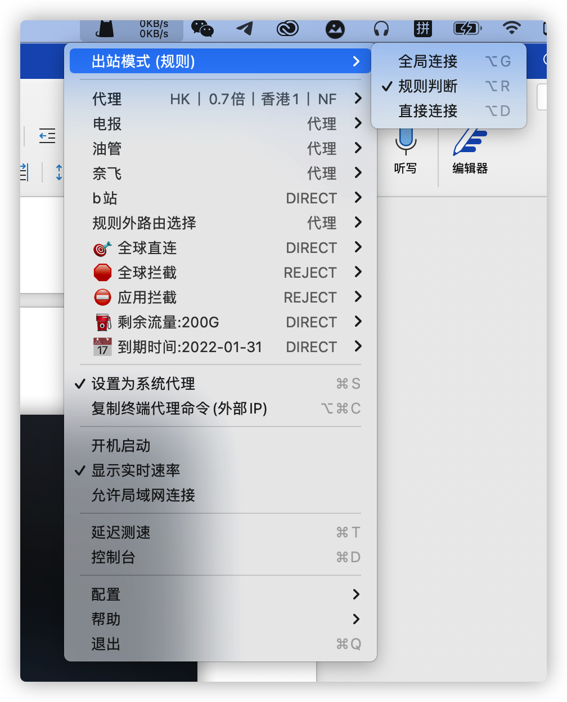
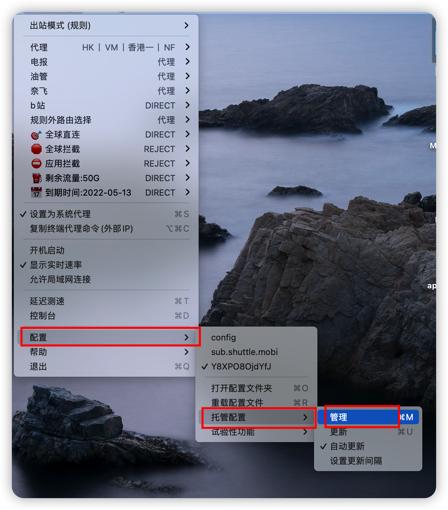
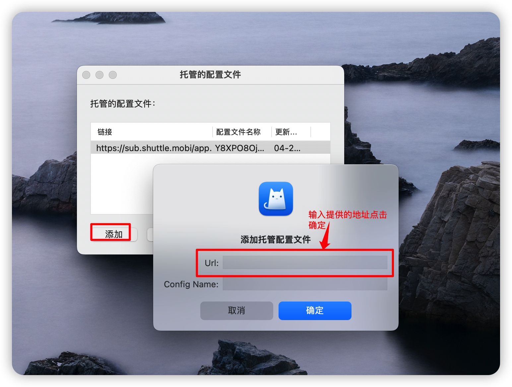
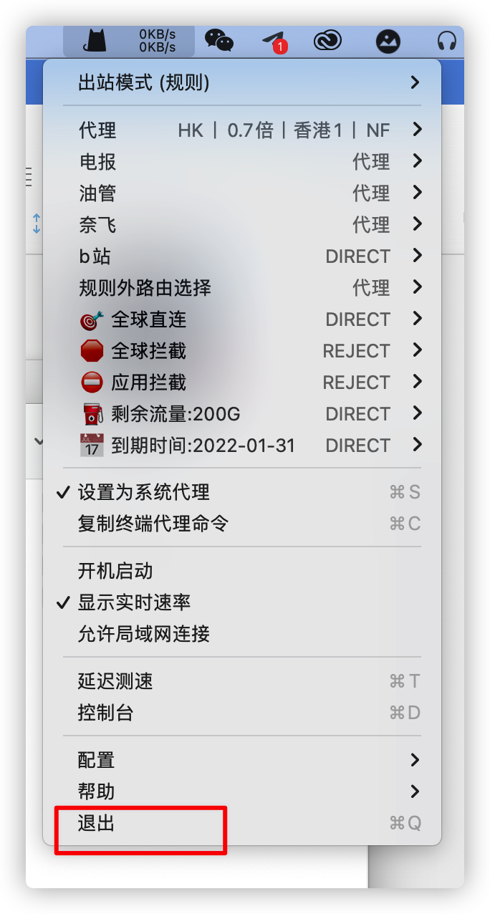

苹果电脑 MAC  设置代理教程
1.安装ClashX 
01.双击安装包，然后拖动图标到右边的文件夹

02.进入启动台找到下面图标，双击，会提示安装一个配置，按照提示输入开机密码安装即可!

03.软件安装完成
2.配置
01 双击软件图标打开，在桌面头部（也可能是底部）找到如下图标，单击一下，按下图配置

02.选择配置—托管配置-管理，然后选择添加，输入https://sub.shuttle.mobi/app/clash/11834/Y8XPO8OjdYfJ点击确认!

03.单击图标，然后选择配置，选择&nbsp;Y8XPO8OjdYfJ.yaml即可翻墙。

04．因为是按流量收费，使用时请注意节约，用完请及时关闭退出!

