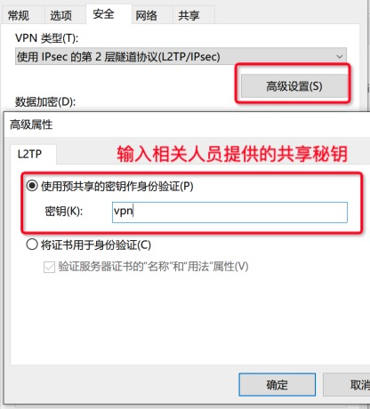

1、点击本地网络（右下角） 打开网络设置

2，点击：VPN,添加VPN

3、按照提示填写信息，其中服务器IP和VPN账号和密码填写自己购买的
 

4、点击“更改适配器选项”

5、找到刚才创建的VPN，然后右键-属性

 

6、在VPN属性安全那里类型选择L2TP 允许使用这些协议打勾，可按照图片操作
 

7、在L2TP模式下点击“高级设置”填写共享密钥（共享密钥找运维或人事索取）

8、回到刚才创建好的VPN 点击连接

