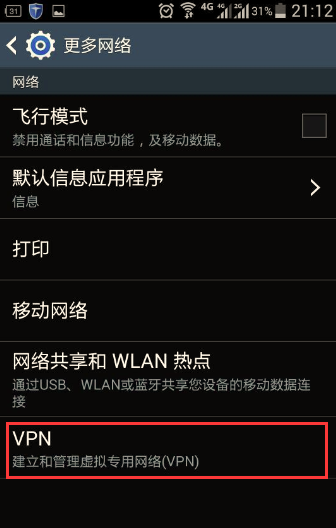
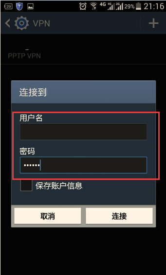

第一步： 打开手机主菜单，选择“设置”。

第二步：打开连接里面的“更多网络”

第三步：选择“VPN”，然后会弹出一个让你设置屏幕解锁PIN码或者密码（这个所有安卓机子都需要的）

第四步：点击右上角加号添加VPN

 

第5步：名称随便写；类型选择“L2TP/IPSEC PSK”；服务器IP地址找客服索取；L2TP密钥和IPSEC识别符不需要写；在IPsec预共享密钥哪里输入"66666666"

第六步：看见刚才创建的VPN，点击可以打开VPN，或者编辑VPN

第七步：填写你购买的VPN帐号和密码点击链接

稍等便会显示连接成功，搞定！