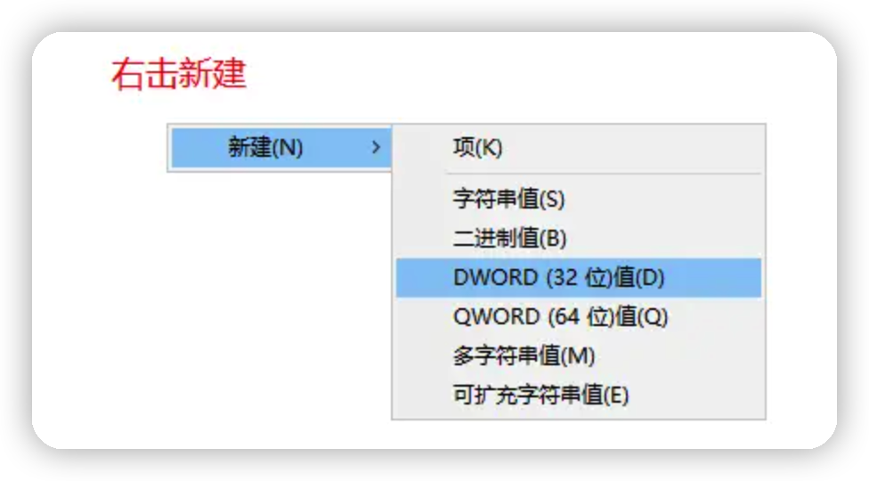

1.mac配置好vpn，点击连接报错如下图

解决方案：
参考：https://blog.csdn.net/sinat_27634939/article/details/104201678 ；
01.打开终端输入 /etc/ppp/options
按i进入编辑模式
然后输入：plugin L2TP.ppp ,也可直接复制粘贴
然后按esc  输入： wp然后点击enter保存即可，具体操作如下图

2.windows配置好vpn，点击连接报错如下图

解决方案：

参考：https://www.bilibili.com/read/cv14863286/ ；
01. 选择win+r 打开运行界面，输入 regedit 打开注册表
找到 HKEY_LOCAL_MACHINE\SYSTEM\CurrentControlSet\Services\RasMan\Parameters（地址可以直接复制粘贴）

找到以下内容 双击修改数值
AllowL2TPWeakCrypto 修改数值1
AllowPPTPWeakCrypto 修改数值1
ProhibitIpSec  修改数值0（没有此文件时可以右键点击新增）

02.接着找到 HKEY_LOCAL_MACHINE\SYSTEM\CurrentControlSet\Services\PolicyAgent（地址可以直接复制粘贴）
AssumeUDPEncapsulationContextOnSendRule 修改数值 2

03.最后我们在电脑 WIN+R 打开运行框，输入 services.msc 
找到Routing and Remote Access服务 双击 启动类型选择为自动
04.最后的最后，我们重启电脑，可以连接了.  具体操作如下：

