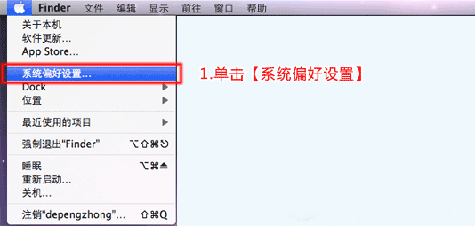

苹果电脑 MAC OS L2TP 设置教程
第1步：单击左上角苹果标志，选择【系统偏好设置...】

第二步：点击“网络”进入网络设置。

第三步：单击【+】,接口选择【VPN】，VPN类型选择【IPSec上的L2TP】，服务名称：默认（可以自定义），然后单击【创建】

第四步：设置【服务器IP】,【用户名】，然后单击【鉴定设置】

第五步：设置【密码】，机器鉴定选择【共享的密钥（密钥找运维或人事索取）】，设置好后单击【好】，然后单击【高级...】

第六步：【通过VPN连接发送所有通信】一定要选中！闲置时间可以修改的长一些。单击【好】，然后单击【连接】即可连接VPN网络

OK，连接成功。不使用时记得在“设置”里面断开V-P-N连接。